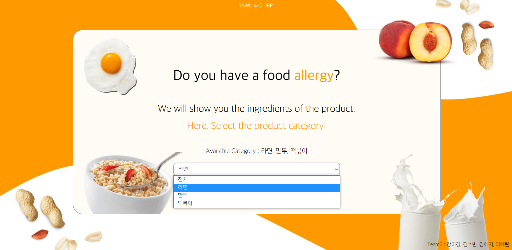
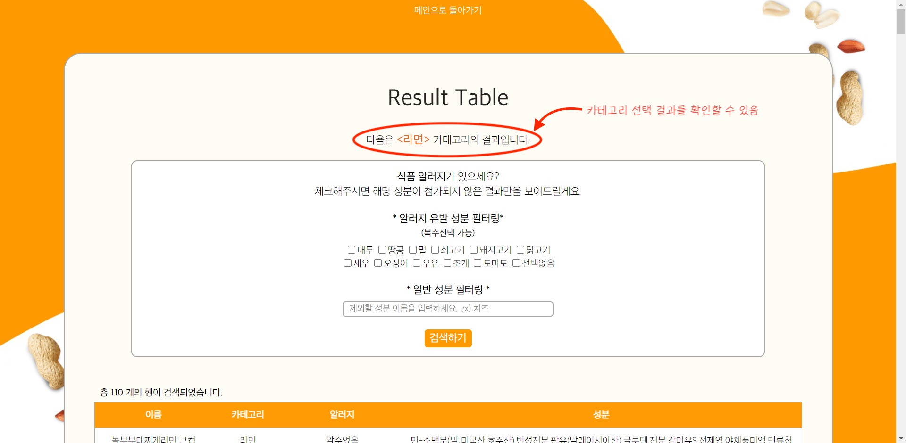
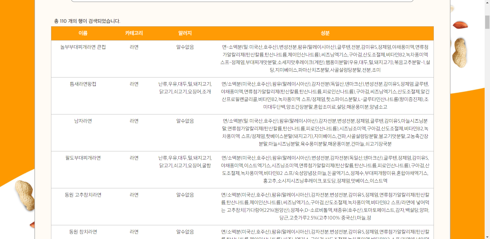
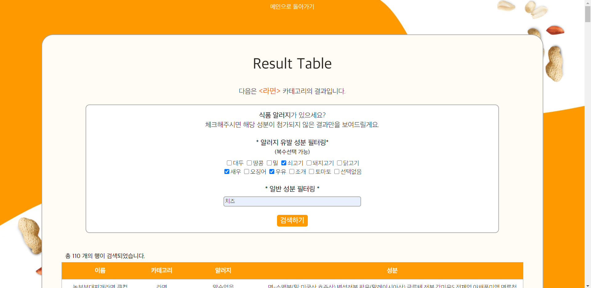
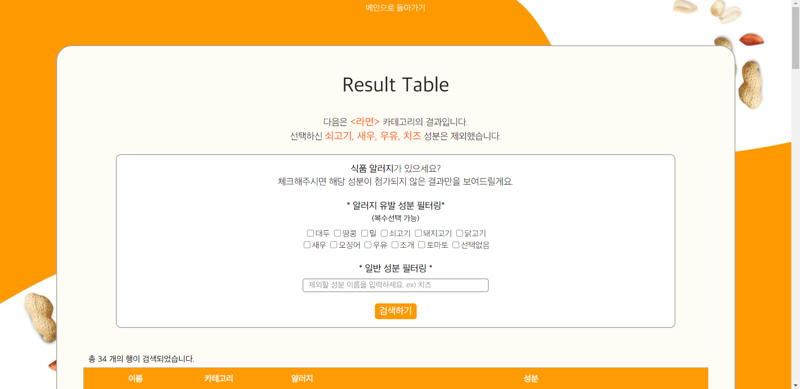
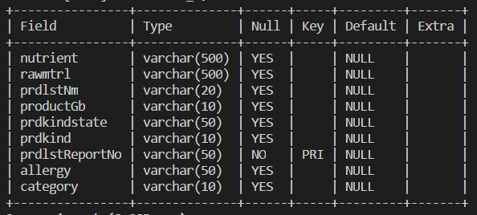
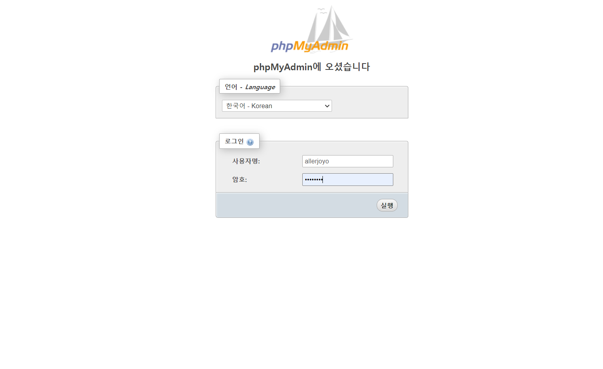
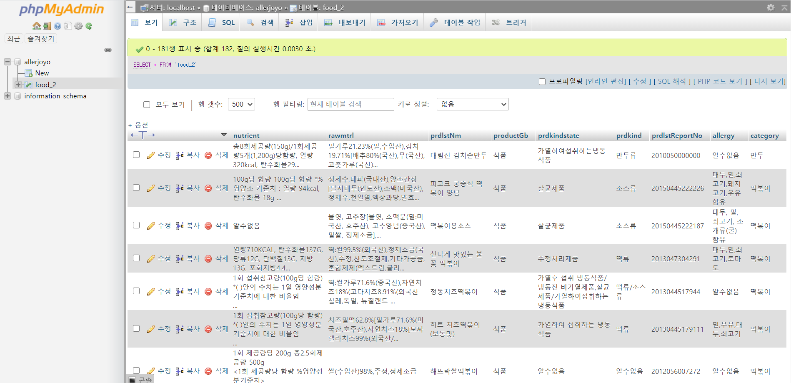
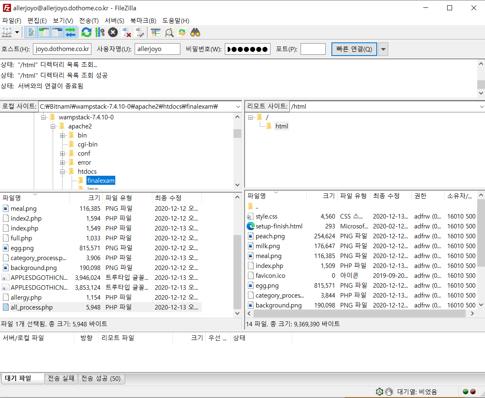

# dbp-t06: 🍑🥛🥜Aller-joyo(알러조요)🥜🥛🍑
* 아래 이미지를 클릭하면 홈페이지로 링크됨.

## 🍑 목차
  * [🍑 기획 배경 및 목적](#기획-배경-및-목적)
    + [🥛 기획 배경](#🥛-기획-배경)
    + [🥛 기획 목적](#🥛-기획-목적)
  * [🍑 Aller-joyo 서비스 소개](#🍑-aller-joyo-서비스-소개)
    + [🥛 서비스 개요](#🥛-서비스-개요)
    + [🥛 서비스 상세](#🥛-서비스-상세)
      - [🥜 메인 화면](#🥜-메인-화면)
      - [🥜 카테고리 선택 결과](#🥜-카테고리-선택-결과)
    + [🥜 알러지 유발 성분 및 일반 성분 필터링](#🥜-알러지-유발-성분-및-일반-성분-필터링)
  * [🍑 개발 환경 및 언어](#🍑-개발-환경-및-언어)
    + [🥛 개발 환경](#🥛-개발-환경)
    + [🥛 개발 언어](#🥛-개발-언어)
  * [🍑 개발 과정](#🍑-개발-과정)
    + [🥛 데이터 수집 과정](#🥛-데이터-수집-과정)
      - [🥜 수집할 데이터 선택](#🥜-수집할-데이터-선택)
      - [🥜 데이터 생성](#🥜-데이터-생성)
    + [🥛 프론트엔드 개발 과정](#🥛-프론트엔드-개발-과정)
      - [🥜 참조할 디자인 셀렉](#🥜-참조할-디자인-셀렉)
      - [🥜 디자인 초안 만들기](#🥜-디자인-초안-만들기)
      - [🥜 웹에서 구현하기](#🥜-웹에서-구현하기)
    + [🥛 백엔드 개발 과정](#🥛-백엔드-개발-과정)
      - [🥜 테이블 생성](#🥜-테이블-생성)
      - [🥜process](#🥜-process)
    + [🥛 서버 연결 과정](#🥛-서버-연결-과정)
      - [🥜 데이터베이스](#🥜-데이터베이스)
      - [🥜 FTP 서버](#🥜-ftp-서버)
  * [🍑 역할 분담](#🍑-역할-분담)
  * [🍑 출처](#🍑-출처)

## 기획 배경 및 목적
### 🥛 기획 배경
* 알러지 유발 성분 표기가 미비한 식품들이 많음을 알게됨.

### 🥛 기획 목적
* 알러지 유발 성분 표기가 미비한 식품들 안전하게 섭취할 수 있도록 알러지 유발 성분을 검색하여 필터링 할 수 있는 서비스를 제공하고자 함.

## 🍑 Aller-joyo 서비스 소개
### 🥛 서비스 개요
* Allergy + 알려줘요
* 다양한 떡볶이, 라면, 만두 카테고리에 속하는 공산품의 전성분 중 사용자가 선택한 식품 성분을 필터링해주는 서비스임.
* 사용자는 개인의 체질, 기호, 신념 등에 맞지 않는 전성분을 선택 또는 입력하여 섭취 가능한 식품을 확인할 수 있음.

### 🥛 서비스 상세
#### 🥜 메인 화면
* 메인 화면인 index.php는 아래 이미지와 같음.

* 메인화면에서 사용자는 검색할 식품의 카테고리를 드롭다운 메뉴에서 선택할 수 있음. 현재 가능한 카테고리는 라면, 만두, 떡볶이 세 가지임. 카테고리를 분류하지 않고 싶다면 '전체'를 선택하면 됨.

#### 🥜 카테고리 선택 결과
* '라면' 카테고리를 선택한 결과는 다음과 같음.
* 상단에는 알러지 유발 성분을 필터링 할 수 있는 메뉴가 나옴. 안내 문구로 어떤 카테고리를 선택하였는지 쉽게 알 수 있음.

* 성분 필터링 메뉴 밑에 테이블로 '라면' 카테고리에 해당하는 제품들이 보여짐.

### 🥜 알러지 유발 성분 및 일반 성분 필터링
* 사용자는 거르고 싶은 알러지 유발 성분과 일반 성분을 선택 및 입력한 후 검색하기 버튼을 누름.

* 필터링한 성분에 대한 결과를 확인할 수 있음. 어떤 성분을 필터링하였는지는 상단의 안내 문구로 쉽게 확인할 수 있음.

## 🍑 개발 환경 및 언어
### 🥛 개발 환경
* Apache, MySQL
### 🥛 개발 언어
* PHP, HTML, CSS

## 🍑 개발 과정
### 🥛 데이터 수집 과정
#### 🥜 수집할 데이터 선택
* 공공데이터포털에서 활용하고자 하는 API 개발 활용 신청 후 인증키 발급받음.
#### 🥜 데이터 생성
* 해당 API에 쿼리를 던져 JSON 형태로 리스펀스 받음.

* JSON 데이터에서 필요한 부분만 뽑아냄.
* JSON 데이터를 CSV 파일로 변환함.
  * [온라인 JSON to CSV converter](http://convertcsv.com/json-to-csv.htm)를 사용함.
* Numbers를 이용하여 Aller-joyo에 필요한 'category' 컬럼을 추가하고 값 추가함.

* 완성된 데이터를 CSV 파일로 export함.
--------------------------------------
### 🥛 프론트엔드 개발 과정
#### 🥜 참조할 디자인 셀렉  
* 프로젝트의 컨셉에 따라 음식과 관련된 디자인을 선택한 후 색 코드를 정리함.

#### 🥜 디자인 초안 만들기  
* 포토샵을 할 줄 몰라 그림판을 이용. (포토샵의 중요성을 알게 되었다)디자인 프레임을 생성한 후에 이미지, 문구, 폰트 등의 디테일은 웹 페이지의 컨셉에 맞게 재디자인하여 초안 완성.

#### 🥜 웹에서 구현하기  
* 최소한의 디자인만 포함한 이미지를 웹의 background로 삽입한 이후에 나머지는 HTML, CSS 바탕으로 구현함. 이미지와 요소들은 주로 `position:absolute`를 이용해 배치시킴.

--------------------------------------
### 🥛 백엔드 개발 과정
#### 🥜 테이블 생성
* 테이블 생성 후 food_3.csv 파일의 데이터를 집어넣음

#### 🥜process
1. index.php
* 라면, 만두, 떡볶이, 전체로 이루어져 있는 카테고리를 선택하면 `category_process.php`로 category 데이터를 POST로 전달한다.
2. category.php
* `query = "SELECT prdlstNm, rawmtrl, allergy, category FROM food WHERE category LIKE '%{$filtered_category}%'`
* `index.php`에서 `LIKE`를 사용해 카테고리에 해당되는 데이터들만 선택해 음식 이름, 성분, 알러지, 카테고리를 화면에 나타내준다.
* 해당 카테고리에서 알러지 유발 성분(대두, 밀 땅콩 등)을 체크박스를 통해 선택하고 거르고 싶은 성분을 text box에 집어넣으면 `all_process.php`에 선택한 성분 데이터들(allergy, nutrient)과 현재 페이지의 카테고리가 POST로 전달된다.
3. all_process.php
* `query = "SELECT prdlstNm, rawmtrl ,allergy, category FROM food WHERE category LIKE '%{$category}%' and NOT REGEXP_LIKE(rawmtrl, '{$filtered_nutrient_query}') and NOT REGEXP_LIKE(allergy,'{$filtered_allergy}') and NOT REGEXP_LIKE(rawmtrl, '{$filtered_allergy}')"`
* `NOT REGEXP_LIKE`를 사용해 다중 선택된 성분과 알러지들을 필터링해서 결과값을 나타내준다.
--------------------------------------
### 🥛 서버 연결 과정
#### 🥜 데이터베이스
* 닷홈 주소를 만들 때 생성되는 phpMyAdmin을 이용함

* '가져오기' 에서 .csv파일로 저장된 데이터들을 food테이블에 넣어주었음

#### 🥜 FTP 서버
* FileZilla를 이용해서 만들었음.  호스트, 사용자ID, 비밀번호를 이용하여 접속함
* /host/home1/allerjoyo/html/ 경로에 .php파일, .css파일, .png파일을 넣어주었음

## 🍑 역할 분담
* [20160965 통계학과 강미경](https://github.com/gyeong707): 프론트엔드, 백엔드, 프론트엔드 & 백엔드 병합
* [20172025 컴퓨터공학과 김수빈](https://github.com/subin0206): 백엔드, 백엔드 코드 병합
* [20172081 컴퓨터공학과 이혜린](https://github.com/HYERIN0718): 백엔드, 서버에 올리기
* [20180978 컴퓨터공학과 김혜지](https://github.com/milsakim): 데이터 수집 & 생성, 백엔드, README 작성

## 🍑 출처
* 데이터 수집
  * [공공데이터 포털](https://data.go.kr/tcs/dss/selectApiDataDetailView.do?publicDataPk=15033303)
* 프론트 엔드
  * [디자인 참고](https://www.behance.net/gallery/105457801/Website-for-peanut-paste-shop-Landing-page?tracking_source=search_projects_appreciations%7Cfood)
  * [이미지](http://pngimg.com)
  * [폰트](http://blog.naver.com/PostView.nhn?blogId=yangwonder&logNo=221934305968&categoryNo=0&parentCategoryNo=34&viewDate=&currentPage=1&postListTopCurrentPage=1&from=search)
